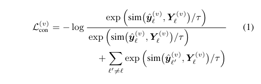

## Contrastive Loss

| positive       | positive distance aggregation | negative        | negative distance aggregation | contrastive/margin |
| -------------- | ----------------------------- | --------------- | ----------------------------- | ------------------ |
| different text | sum                           | different label | sum                           | pos - neg          |
| different text | sum                           | different label | sum                           | Ratio              |
| different text | sum                           | different label | sum                           | InfoNCE            |
| different text | sum of exp                    | different label | sum of exp                    | InfoNCE            |
| ground truth   | N/A                           | different label | sum of exp                    | InfoNCE            |

todo

| positive     | positive distance aggregation | negative        | negative distance aggregation | contrastive |
| ------------ | ----------------------------- | --------------- | ----------------------------- | ----------- |
| ground truth | N/A                           | different label | sum of exp                    | marginal    |

## Results - expresso; pitch 

### default

### contrastive7_1_1

### contrastive7_1_0.1

### contrastive7_0.1_0.1

### contrastive7_0.1_1

todo

## Results - others

### meld; emotion; pitch; contrastive

### meld; sentiment; pitch; contrastive

### meld; emotion; pitch; default

todo

### meld; emotion; pitch; default

todo

## Math

